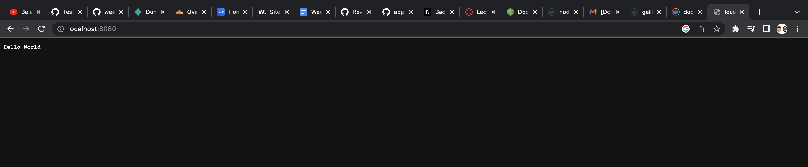
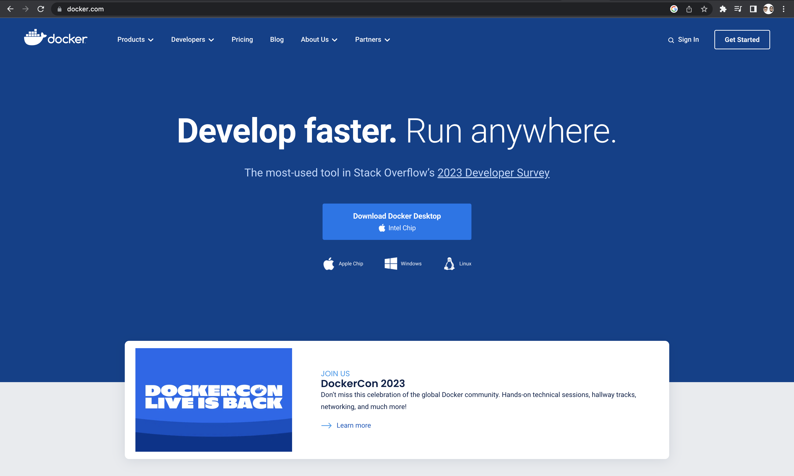
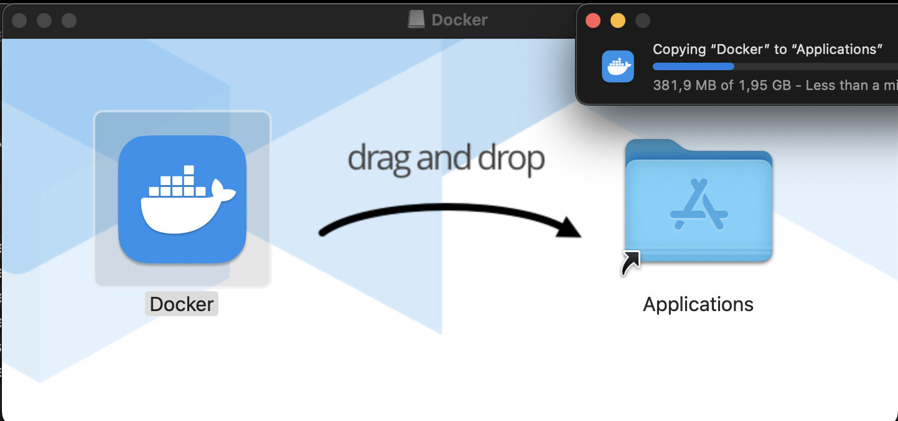
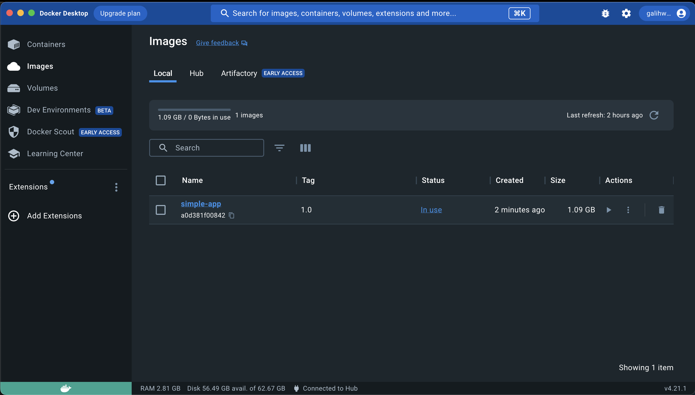
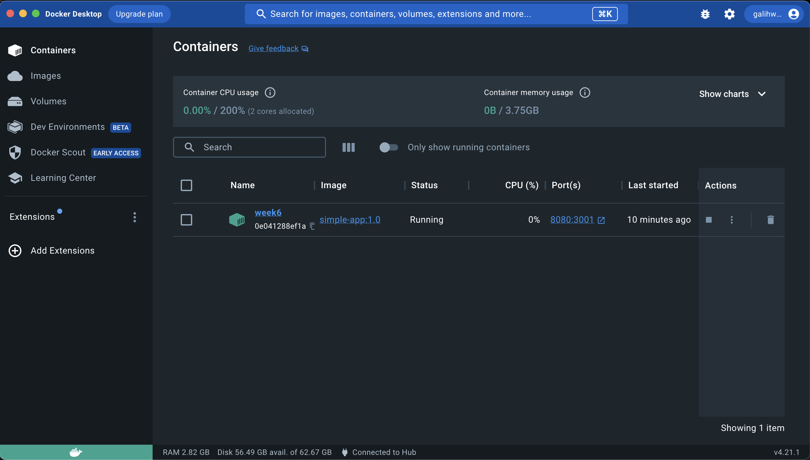

# Implementation Docker 
Getting started to backend development and cloud computing by serving a simple node js application on docker container. 
<br>


## Installation and Setting up Docker 

1. Go to website Docker, you can access with this link [Docker Website](https://www.docker.com/)
   
2. Just click button "Dowload Docker Dekstop", the website already recommends according to your os
3. Wait until the download done 
4. In mac os you just drag the installer to application folder
   
5. After the installation done you just follow the instruction
6. You can check the docker version in your terminal/command prompt
    ```
    docker --version
    Docker version 24.0.2, build cb74dfc
    ```

## Deploying Application on Docker 

1. Create directory for dockerfile
2. Configure package.json that corresponds to application requirements
   ```
   {
    "name": "Simple-App",
    "version": "1.0.0",
    "description": "Assignment for week 6",
    "main": "app.js",
    "scripts": {
      "test": "echo \"Error: no test specified\" && exit 1"
    },
    "author": "",
    "license": "ISC",
    "dependencies": {
      "http": "^0.0.1-security"
    }
   }
   ```
3. Configure Dockerfile to build the application image
    ```
    FROM node:latest

    WORKDIR /app

    COPY . /app/

    RUN npm install 

    CMD ["node", "app.js"]
    ```
4. Build the image using the dockerfile.
    ```
    docker build -t simple-app:1.0 .

    [+] Building 192.3s (10/10) FINISHED                                                        docker:desktop-linux
    => [internal] load build definition from Dockerfile                                                        0.1s
    => => transferring dockerfile: 123B                                                                        0.0s
    => [internal] load .dockerignore                                                                           0.1s
    => => transferring context: 52B                                                                            0.0s
    => [internal] load metadata for docker.io/library/node:latest                                              6.5s
    => [auth] library/node:pull token for registry-1.docker.io                                                 0.0s
    => [1/4] FROM docker.io/library/node:latest@sha256:32ec50b65ac9572eda92baa6004a04dbbfc8021ea806fa62d373  181.6s
    => => resolve docker.io/library/node:latest@sha256:32ec50b65ac9572eda92baa6004a04dbbfc8021ea806fa62d37336  0.0s
    => => sha256:2320f9be4a9c605d1ac847cf67cec42b91484a7cf7c94996417a0c7c316deadc 64.11MB / 64.11MB          118.4s
    => => sha256:980cf5b26237081e7e05515f385cd8eb270cf41fd13538a146c473040b10abd8 2.00kB / 2.00kB              0.0s
    => => sha256:250e9c100ea2ad5745b8c69edef0c3dcf9b2cbb055fb7dbd4fe7fb3f9fa45bae 7.24kB / 7.24kB              0.0s
    => => sha256:d52e4f012db158bb7c0fe215b98af1facaddcbaee530efd69b1bae07d597b711 49.55MB / 49.55MB           30.2s
    => => sha256:7dd206bea61ff3e3b54be1c20b58d8475ddd6f89df176146ddb7a2fd2c747ea2 24.03MB / 24.03MB           43.4s
    => => sha256:32ec50b65ac9572eda92baa6004a04dbbfc8021ea806fa62d37336183cad04e6 1.21kB / 1.21kB              0.0s
    => => sha256:6e5565e0ba8dfce32b9049f21ceeb212946e0bb810d94cbd2db94ca61082f657 211.00MB / 211.00MB        152.9s
    => => extracting sha256:d52e4f012db158bb7c0fe215b98af1facaddcbaee530efd69b1bae07d597b711                   9.7s
    => => sha256:5f1526a28cf91707a0af45c5624979f67215b1330efd66c05a0f94839c96f0bc 3.37kB / 3.37kB             45.8s
    => => extracting sha256:7dd206bea61ff3e3b54be1c20b58d8475ddd6f89df176146ddb7a2fd2c747ea2                   2.2s
    => => sha256:d89b7e3d6e3496e51a2a10dfea2cbf36ba8501b95bb374489b955e39e4d9ffdc 47.52MB / 47.52MB          108.4s
    => => sha256:8831f71a931426419aadda667fd199559851d94658edf73c637801f675fbc463 2.27MB / 2.27MB            112.2s
    => => sha256:beef33e6bd26ef8d9ecfb29760a482aab3272d855db9e4d0c0fd4131d54ef827 449B / 449B                113.2s
    => => extracting sha256:2320f9be4a9c605d1ac847cf67cec42b91484a7cf7c94996417a0c7c316deadc                  10.8s
    => => extracting sha256:6e5565e0ba8dfce32b9049f21ceeb212946e0bb810d94cbd2db94ca61082f657                  22.1s
    => => extracting sha256:5f1526a28cf91707a0af45c5624979f67215b1330efd66c05a0f94839c96f0bc                   0.0s
    => => extracting sha256:d89b7e3d6e3496e51a2a10dfea2cbf36ba8501b95bb374489b955e39e4d9ffdc                   5.6s
    => => extracting sha256:8831f71a931426419aadda667fd199559851d94658edf73c637801f675fbc463                   0.1s
    => => extracting sha256:beef33e6bd26ef8d9ecfb29760a482aab3272d855db9e4d0c0fd4131d54ef827                   0.0s
    => [internal] load build context                                                                           0.1s
    => => transferring context: 27.26kB                                                                        0.0s
    => [2/4] WORKDIR /app                                                                                      0.9s
    => [3/4] COPY . /app/                                                                                      0.1s
    => [4/4] RUN npm install                                                                                   3.0s
    => exporting to image                                                                                      0.1s
    => => exporting layers                                                                                     0.1s
    => => writing image sha256:826bd0889f115a4523a37ff448fae04fedd53ee3737895bc7f54bf0445d567cb                0.0s
    => => naming to docker.io/library/simple-app:1.0                                                           0.0s
    ```
5. Verify the images has been built by running this command:
    ```
    docker images
    REPOSITORY   TAG       IMAGE ID       CREATED             SIZE
    simple-app   1.0       a0d381f00842   About an hour ago   1.1GB
    ```
    
6. Create Container for your images
    ```
    docker container create --name week6 -p 8080:3001 simple-app:1.0
    0e041288ef1ad5372cb1fb81e8faab030372626ff26462cd8c0ffe4a0877af41
    ```
    
7. Verify the container has been built by running this command:    
    ```
    docker container ls --all
    CONTAINER ID   IMAGE            COMMAND                  CREATED          STATUS    PORTS     NAMES
    0e041288ef1a   simple-app:1.0   "docker-entrypoint.s…"   24 seconds ago   Created             week6
    ```
8. Start container by running this command: 
    ```
    docker container start week6
    week6
    ```
9.  After start your container you can check with this command:
    ```
    docker container ls
    CONTAINER ID   IMAGE            COMMAND                  CREATED              STATUS          PORTS                    NAMES
    0e041288ef1a   simple-app:1.0   "docker-entrypoint.s…"   About a minute ago   Up 34 seconds   0.0.0.0:8080->3001/tcp   week6
    ```
10. Open your Browser and try localhost:8080 in your browser
    

<br>

[](https://classroom.github.com/a/nj7iw4Wb)
